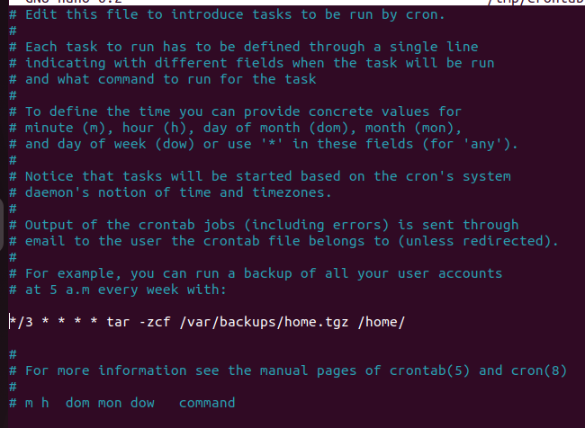

# Решение задания 1 (Linux)

1. Используйте команды операционной системы Linux и создайте две новых директории – «Игрушки для школьников» и «Игрушки для дошколят»

   ```bash
   mkdir 'Игрушки для школьников'

   mkdir 'Игрушки для дошколят'
   ```

2. Создайте в директории «Игрушки для школьников» текстовые файлы - «Роботы», «Конструктор», «Настольные игры»

   ```bash
   touch 'Игрушки для школьников'/Роботы 'Игрушки для школьников'/Конструктор 'Игрушки для школьников'/'Настольные игры'
   ```

3. Создайте в директории «Игрушки для дошколят» текстовые файлы «Мягкие игрушки», «Куклы», «Машинки»

   ```bash
   touch 'Игрушки для дошколят'/'Мягкие игрушки' 'Игрушки для дошколят'/Куклы 'Игрушки для дошколят'/Машинки
   ```

4. Объединить 2 директории в одну «Имя Игрушки»

   ```bash
   rsync -r 'Игрушки для школьников'/ 'Имя Игрушки' | rsync -a 'Игрушки для дошколят'/ 'Имя Игрушки'
   ```

5. Переименовать директорию «Имя Игрушки» в «Игрушки»

   ```bash
   mv 'Имя Игрушки' Игрушки
   ```

6. Просмотреть содержимое каталога «Игрушки»

   ```bash
   ls -la Игрушки
   ```

7. Установить и удалить snap-пакет. (Любой, какой хотите)

   ```bash
   sudo snap install telegram-desktop # Установка
   
   sudo snap remove telegram-desktop # Удаление
   ```

8. Добавить произвольную задачу для выполнения каждые 3 минуты (Например, запись в текстовый файл чего-то или копирование из каталога А в каталог Б)

   ```bash
   crontab -e
   ```

   редактируем как на скриншоте:

   
